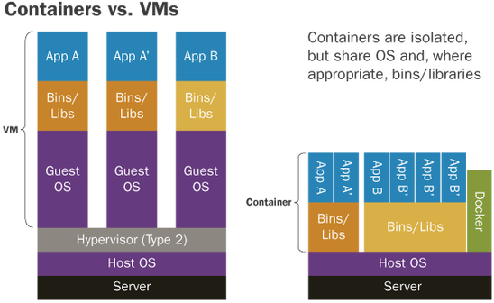

# Docker
## Introduction
### VM vs. Docker

 

## Main Components

- Docker client: send commands
- Docker Daemon: server to handle requests
  - `/etc/systemd/system/multi-user.target.wants/docker.serivce` `-H tcp://0.0.0.0`: configuration to accept remote requests (no need to do)
  - `systemctl daemon-reload` and `systemctl restart docker.service`
  - `docker -H 192.168.88.8 info`: example (no need to do)
- Registry: host Docker images

## Terminology
- image: a lightweight executable package that includes everything needed to run a piece of software, including the code, a runtime, libraries, environment variables, and config files.
  - *image name* = *repository* + *tag*
- container: a runtime instance of an image -- what the image becomes in memory when actually executed. It runs completely isolated from the host environment by default, only accessing host files and ports if configured to do so.
- registry: image store

## Installation
- [Docker Installation](installation/README.md)

## Image
### Image Layer

- bootfs: the kernel on the host to be shared by all the containers
  - `uname -r` on the host and in the container: the same kernel info

- rootfs: each container's userspace filesystem, it includes /dev, /proc, /bin
 

- image contains multiple layers which are mutable

- container layer: only the top layer is a writable layer corresponds to a container 

- [Docker Image Manipulation](image/README.md)

## Container
- [Docker Container](container/README.md)

## Volume
- [Docker Volume](volume/README.md)

## Network
- [Docker Network](network/README.md)

## Dockerfile
- [Docker Dockerfile](dockerfile/README.md)

## docker-compose
- [Docker Compose](docker-compose/README.md)

## TPWordPress 
- [WordPress Deployment](tp/wordpress/README.md)
- [Frontend and Backend Deployment](tp/frontbackend/README.md)
- [Python Web Server](tp/python-server/README.md)

## Advanced Topics
- [Advanced Topics](topics/README.md)

